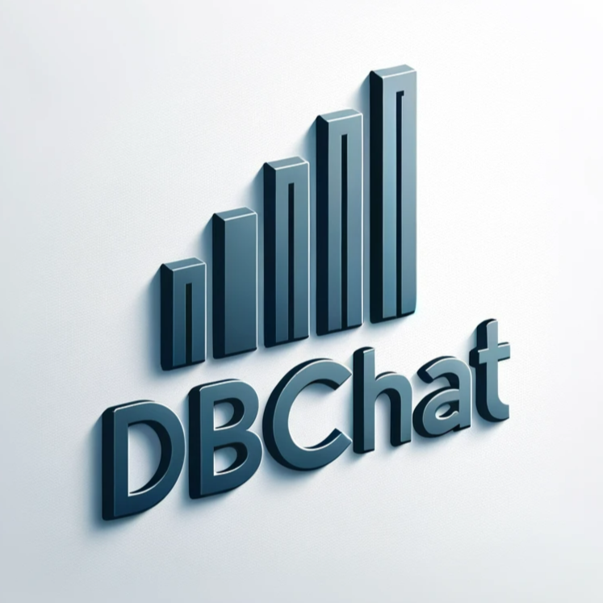

<h1 align="center">
  HKUST BDT project: DBChat
</h1>

  </a>

   Easily query your database using natural language 

  
# DBChat
DBChat represents a fully integrated and locally deployed solution for natural language to SQL conversion.  

We fine-tune the LLaMA-2-70B-base large language model (LLM) using the Spider dataset from Yale University to effectively address Natural Language to SQL (NL to SQL) query tasks. By incorporating open source frameworks like RAG, we enhance the model's ability to comprehend crucial aspects such as the user's database structure, field names, and other essential background knowledge.  

To provide users with an optimal interactive experience, we have meticulously designed a user-friendly front end. Moreover, we leverage databases for efficient storage of relevant data and thorough performance testing of the model.  

Based on the test results, it is evident that DBChat performs well on small databases. However, as the complexity of the database increases, the model's performance tends to decline. This observation highlights an area for further improvement and optimization in future iterations of DBChat.  

## Reference
1. https://github.com/chatchat-space/Langchain-Chatchat
2. https://github.com/eosphoros-ai/DB-GPT
3. https://github.com/eosphoros-ai/DB-GPT-Hub
4. https://github.com/eosphoros-ai/Awesome-Text2SQL
5. https://github.com/lm-sys/FastChat
6. https://github.com/edw008/LLaMA-Efficient-Tuning
