##MySQL Schema for Test

---
### 1 Introduction

We collected three databases of different volumes for testing as following:
- **Employees**
  A typical company employee and departmental management system covering basic employee information, departmental information, employee's tenure in the department, employee's title, salary, and updates on the employee's work in the department.
- 8 tables
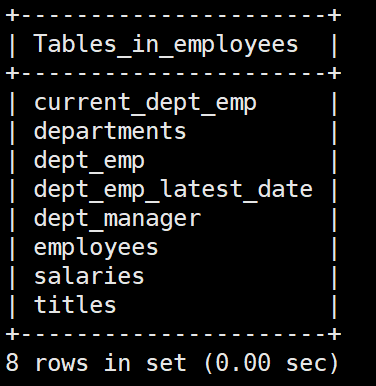
- **MovieRental**
  A database for a movie rental system that contains the various tables and views needed to manage a movie rental business, covering everything from movies, actors, and categories to rentals, inventory, and customer management.
- 23 tables
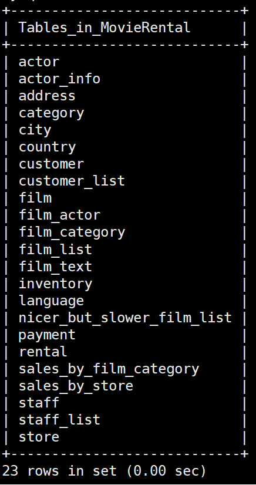
- **Ecommerce**
  A huge database of e-commerce platforms containing management functions for products, orders, merchants and other elements.
- 96 tables
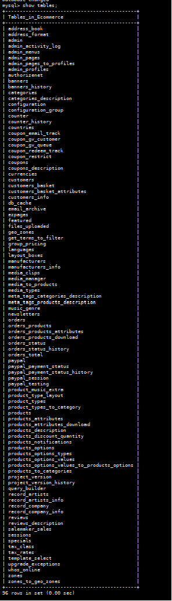


### 2 E-R Diagrams
The following diagram provides an overview of E-R of the 3 databases:
- **Employees**

- **MovieRental**
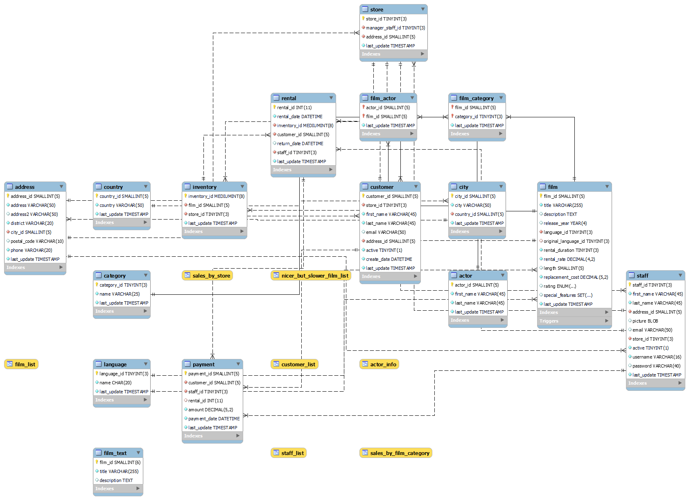
- **Ecommerce**


### 3 Test Cases
#### 3.1 Employees
>Test case0：自然语言描述：
"查出员工号是88888的员工的名字和姓。"

>Find out the first and last name of the employee whose employee number is 88888.

``````
SELECT 
    first_name,
    last_name
FROM 
    employees
WHERE 
    emp_no = 88888;
``````
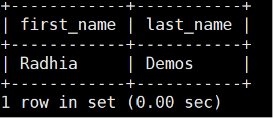

>Test case1：自然语言描述：
"显示每个部门的平均工资，结果包括部门名称和该部门所有员工的平均工资。"

>Displays the average salary for each department, with results including the name of the department and the average salary of all employees in that department.

``````
SELECT 
    d.dept_name,
    AVG(s.salary) AS average_salary
FROM 
    departments d
    JOIN dept_emp de ON d.dept_no = de.dept_no
    JOIN salaries s ON de.emp_no = s.emp_no
GROUP BY 
    d.dept_name;
``````

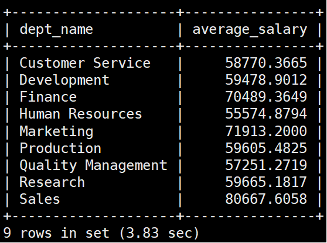

>Test case2：自然语言描述：
"找出在1989年1月1日至1990年1月1日之间收到最高工资的前10名员工，结果包括他们的员工编号、名字、姓和最高工资。"

>Find the top 10 employees who received the highest salary between January 1, 1989 and January 1, 1990, with results including their employee number, first name, last name, and highest salary.

``````
SELECT 
    e.emp_no,
    e.first_name,
    e.last_name,
    MAX(s.salary) AS highest_salary
FROM 
    employees e
    JOIN salaries s ON e.emp_no = s.emp_no
WHERE 
    s.from_date >= '1989-01-01' AND s.to_date <= '1990-01-01'
GROUP BY 
    e.emp_no
ORDER BY 
    highest_salary DESC
LIMIT 10;
``````

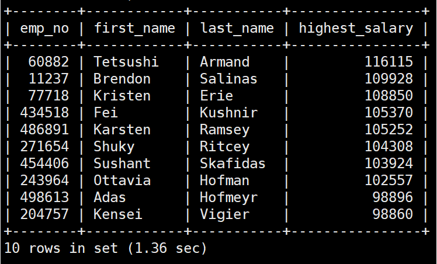

>（复杂）Test case3: 自然语言描述：
对于员工号为12345的员工，显示他的个人信息（包括员工号、名字、姓）以及他在不同部门的工作历史，包括每段工作的起止日期和在该期间的平均工资。

>For an employee with employee number 12345, his personal information (including employee number, first name, and last name) is displayed, as well as his work history in different departments, including the start and end dates of each job and his average salary during that period.

``````
SELECT 
    e.emp_no,
    e.first_name,
    e.last_name,
    d.dept_name,
    de.from_date,
    de.to_date,
    AVG(s.salary) AS average_salary
FROM 
    employees e
    JOIN dept_emp de ON e.emp_no = de.emp_no
    JOIN departments d ON de.dept_no = d.dept_no
    JOIN salaries s ON e.emp_no = s.emp_no
WHERE 
    e.emp_no = '12345'
    AND s.from_date BETWEEN de.from_date AND de.to_date
GROUP BY 
    e.emp_no, d.dept_name, de.from_date, de.to_date;
``````

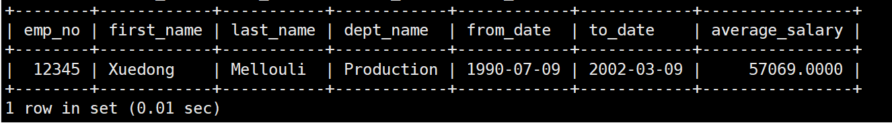


### 3.2 MovieRental
>Test case1: 自然语言描述：
查找名为 'Customer1' 的客户的名字和姓以及他租赁的所有电影的标题和租赁日期。

>Find the first and last name of a customer named 'Customer1' along with the titles and rental dates of all the movies he rented.

``````
SELECT c.first_name, c.last_name, f.title, r.rental_date
FROM customer c
JOIN rental r ON c.customer_id = r.customer_id
JOIN inventory i ON r.inventory_id = i.inventory_id
JOIN film f ON i.film_id = f.film_id
WHERE c.first_name = 'Customer1';
``````
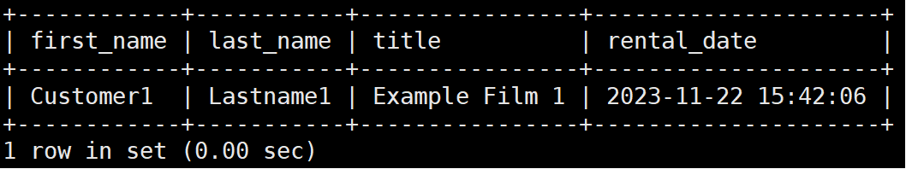

>Test case2: 自然语言描述：
查找名为 'Alice' 的员工的名字和姓以及她的详细地址信息，包括街道地址、城市和国家。

>Find the first and last name of an staff named 'Alice' along with her full address information including street address, city and state.

``````
SELECT s.first_name, s.last_name, a.address, city.city, country.country
FROM staff s
JOIN address a ON s.address_id = a.address_id
JOIN city ON a.city_id = city.city_id
JOIN country ON city.country_id = country.country_id
WHERE s.first_name = 'Alice';
``````
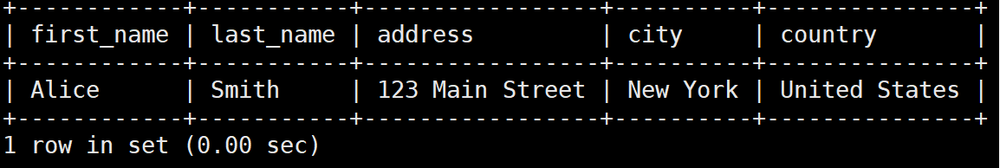

### 3.3 Ecommerce

>Test case2: 自然语言描述：
"显示一个特定客户的所有订单的详细情况，包括他们买了哪些产品，这些产品属于哪个类别，是哪个制造商生产的，以及这些产品的客户评价有多高。"

>Shows details of all orders for a specific customer, including which products they bought, which category those products belong to, which manufacturer they are made by, and how highly rated those products are by customers.

``````

SELECT 
    c.customers_id,
    c.customers_firstname,
    c.customers_lastname,
    o.orders_id,
    op.products_id,
    p.products_model,
    pd.products_description,
    cat.categories_id,
    cd.categories_name,
    m.manufacturers_name,
    r.reviews_rating,
    rd.reviews_text
FROM 
    customers c
    JOIN orders o ON c.customers_id = o.customers_id
    JOIN orders_products op ON o.orders_id = op.orders_id
    JOIN products p ON op.products_id = p.products_id
    JOIN products_description pd ON p.products_id = pd.products_id
    JOIN products_to_categories ptc ON p.products_id = ptc.products_id
    JOIN categories cat ON ptc.categories_id = cat.categories_id
    JOIN categories_description cd ON cat.categories_id = cd.categories_id
    JOIN manufacturers m ON p.manufacturers_id = m.manufacturers_id
    LEFT JOIN reviews r ON p.products_id = r.products_id
    LEFT JOIN reviews_description rd ON r.reviews_id = rd.reviews_id
WHERE 
    c.customers_id = 1;  #1,2,3
``````
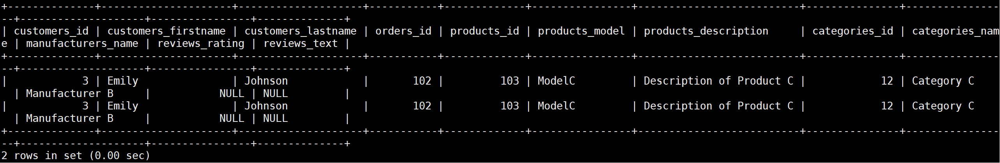
